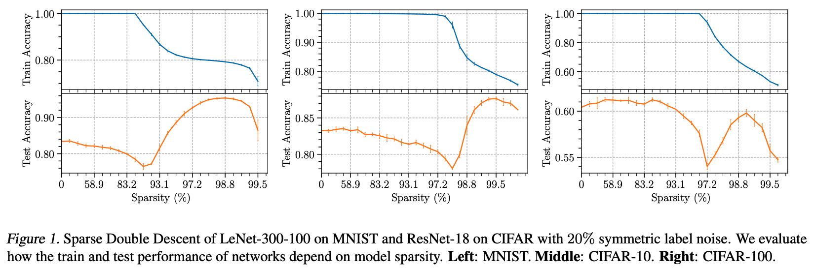

# Sparse Double Descent

This framework implements key experiments on the sparse double descent phenomenon, as demonstrated in the following paper:

- [Sparse Double Descent: Where Network Pruning Aggravates Overfitting](https://arxiv.org/abs/2206.08684). Zheng He, Zeke Xie, Quanzhi Zhu, Zengchang Qin. ICML 2022. 


## Overview
This framework is built upon the [OpenLTH](https://github.com/facebookresearch/open_lth) project. We adopt most of the original implementations, and made additional modications. Followings are the key experiments we include here.
- **Pruning under various settings:**
    - Pruning with various criterions, e.g., magnitude-based pruning, gradient-based pruning and random pruning
    - Pruning with different retraining schedules, e.g., finetuning, lottery ticket rewinding, learning rate rewinding and scratch retraining.
    - Pruning under different label noise types and noise ratios, e.g., symmetric label noise, asymmetric label noise and pair-flip label noise.
- **Re-dense training:** 
    - After pruning and retraining steps, pruned weights are recovered, initialized as zero, and retrained together with the unpruned weights for another t epochs with a fixed learning rate. 
- **Ablation between lottery tickets and random initializations** 
    - After pruning, a network could be retrained using the same mask but a different initialization compared with the lottery ticket network.

## Getting Started
### Prerequisites
- Python >= 3.6
- PyTorch >= 1.4
- TorchVision >= 0.5.0
- Numpy
### Setup
- Install the requirements.
- Modify foundations/local.py so that it contains the paths where you want datasets and results to be stored. To train with Tiny ImageNet, you will need to specify the path where Tiny ImageNet is stored.
### Useage
The ```mian.py``` takes the following subcommands to run.
```
==================================================================================
A Framework on Sparse Double Descent Based on open_lth
----------------------------------------------------------------------------------
Choose a command to run:
    * main.py train [...] => Train a model.
    * main.py rewindLR [...] => Run a pruning and rewinding experiment.
    * main.py lottery [...] => Run a lottery ticket hypothesis experiment.
    * main.py finetune [...] => Run an iterative pruning-finetuning experiment.
    * main.py scratch [...] => Run a pruning and retraining from re-initialized scratch experiment.
    * main.py train_branch [...] => Run a branch of the main experiment.
    * main.py rewindLR_branch [...] => Run a branch of the main experiment.
    * main.py lottery_branch [...] => Run a branch of the main experiment.
    * main.py finetune_branch [...] => Run a branch of the main experiment.
    * main.py scratch_branch [...] => Run a branch of the main experiment.
==================================================================================
```
In practice, you can begin with a set of defaults and optionally modify individual hyperparameters as desired. To view the hyperparameters for each subcommand, use the following command. 
```
main.py [subcommand] [...] --help
```
### Exemplary Runs

#### 1 Various Retraining Schedules
1.1 Lottery Ticket Rewinding
```
python main.py lottery --training_steps=160ep --lr=0.1 --milestone_steps=80ep,120ep --gamma=0.1 --rewinding_steps=1000it --default_hparams=cifar_pytorch_resnet_18 --levels=30 --random_labels_fraction=0.2 --dataset_name=cifar10 --gpu=0 --fix_all_random_seeds=1  
```
1.2 Retraining using Finetuning
```
python main.py finetune  --training_steps=160ep --lr=0.1 --milestone_steps=80ep,120ep --gamma=0.1  --default_hparams=cifar_pytorch_resnet_18 --levels=30 --random_labels_fraction=0.2 --dataset_name=cifar10 --finetune_lr=0.001 --finetune_training_steps=160ep --gpu=0 --fix_all_random_seeds=1
```
1.3 Retraining using Learning Rate Rewinding
```
python main.py rewindLR  --training_steps=160ep --lr=0.1 --milestone_steps=80ep,120ep --gamma=0.1  --default_hparams=cifar_pytorch_resnet_18 --levels=30 --random_labels_fraction=0.2 --dataset_name=cifar10  --gpu=0 --fix_all_random_seeds=1 
```
1.4 Retraining using Sratch Retraining
```
python main.py scratch  --training_steps=160ep --lr=0.1 --milestone_steps=80ep,120ep --gamma=0.1  --default_hparams=cifar_pytorch_resnet_18 --levels=30 --random_labels_fraction=0.2 --dataset_name=cifar10 --gpu=0 --fix_all_random_seeds=1 
```
#### 2 Various Pruning Criterions (magnitude/gradient/random)
```
 python main.py lottery --pruning_strategy=random --training_steps=160ep --lr=0.1 --milestone_steps=80ep,120ep --gamma=0.1 --rewinding_steps=1000it --default_hparams=cifar_pytorch_resnet_18 --levels=30 --random_labels_fraction=0.2 --dataset_name=cifar10 --gpu=0 --fix_all_random_seeds=1 
```
#### 3 Different Label Noise Types (asymmetric/pairflip)
```
python main.py lottery --noisy_labels_type=asymmetric --noisy_labels_fraction=0.2 --training_steps=160ep --lr=0.1 --milestone_steps=80ep,120ep --gamma=0.1 --rewinding_steps=1000it --default_hparams=cifar_pytorch_resnet_18 --levels=30 --dataset_name=cifar10 --gpu=0 --fix_all_random_seeds=1
```
#### 4 Re-dense Training
This experiment requires running a standard pruning task first.
```
python main.py lottery --training_steps=160ep --lr=0.1 --milestone_steps=80ep,120ep --gamma=0.1 --rewinding_steps=1000it --default_hparams=cifar_pytorch_resnet_18 --levels=30 --random_labels_fraction=0.4 --dataset_name=cifar100 --fix_all_random_seeds=1  --gpu=0 
```
Then run the following command for re-dense retraining.
```
python main.py lottery_branch retrain --training_steps=160ep --lr=0.1 --milestone_steps=80ep,120ep --gamma=0.1 --rewinding_steps=1000it --default_hparams=cifar_pytorch_resnet_18 --levels=0,3,6,9,12,15,19,22,26  --random_labels_fraction=0.4 --dataset_name=cifar100  --retrain_d_dataset_name=cifar100 --retrain_d_batch_size=128 --retrain_t_optimizer_name=sgd --retrain_t_lr=0.1  --retrain_t_milestone_steps=80ep,120ep  --retrain_t_gamma=0.1  --retrain_t_training_steps=320ep --retrain_d_random_labels_fraction=0.4  --retrain_t_weight_decay=1e-4  --retrain_t_momentum=0.9 --retrain_t_regain_pruned_weights_steps=160ep  --fix_all_random_seeds=1  --gpu=0 
```
#### 5 Random Reinitialization Ablation
This experiment requires running a standard lottery ticket task first.
```
 python main.py lottery --training_steps=160ep --lr=0.1 --milestone_steps=80ep,120ep --gamma=0.1 --rewinding_steps=1000it --default_hparams=cifar_pytorch_resnet_18 --levels=30 --random_labels_fraction=0.2 --dataset_name=cifar10 --gpu=0 --fix_all_random_seeds=1
```
Then run the following command for random reinitialization.
```
python main.py lottery_branch randomly_reinitialize --training_steps=160ep --lr=0.1 --milestone_steps=80ep,120ep --gamma=0.1 --rewinding_steps=1000it --default_hparams=cifar_pytorch_resnet_18 --levels=1-27 --random_labels_fraction=0.2 --dataset_name=cifar10 --gpu=0 --fix_all_random_seeds=1
```

#### 6 Tiny ImageNet Experiment
In order to save time and computational resources, we use one-shot pruning on Tiny ImageNet dataset.
```
python main.py lottery_branch oneshot_prune --default_hparams=tinyimagenet_resnet_101 --dataset_name=tiny_imagenet --batch_size=512 --lr=0.2 --gpu=0,1,2,3 --level=0-16 --rewinding_steps=1000it --random_labels_fraction=0.2 --milestone_steps=100ep,150ep --training_steps=200ep --fix_all_random_seeds=1
```
## Acknowledgement
We develop our project mainly on the [OpenLTH](https://github.com/facebookresearch/open_lth), which is easy to use and extend, as well as highly flexible. Thanks for the great work!
## Citation
If you find this useful for your research, please cite the following paper.
```
@article{he2022sparse,
  title={Sparse Double Descent: Where Network Pruning Aggravates Overfitting},
  author={He, Zheng and Xie, Zeke and Zhu, Quanzhi and Qin, Zengchang},
  journal={arXiv preprint arXiv:2206.08684},
  year={2022}
}
```

## Contact
If you have any question on these codes, please don't hesitate to contact me by zhenghe@buaa.edu.cn